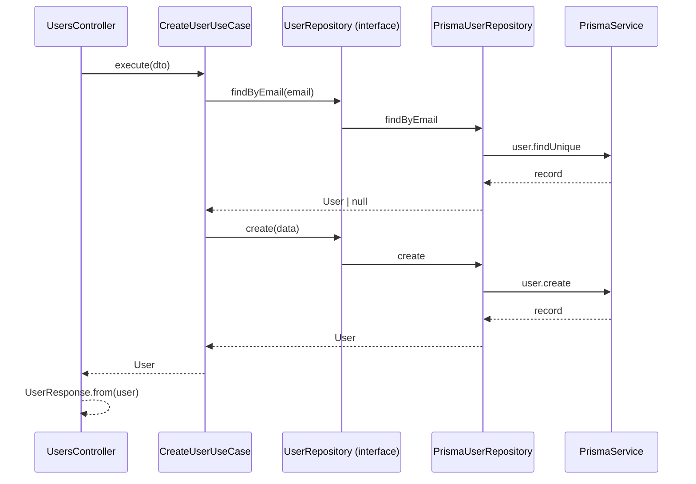

# Arquitetura do Projeto — Offensive World

Este documento descreve a organização do código, as responsabilidades de cada camada e o fluxo de dados da API.

> **Referência da API:** lista completa de endpoints com entradas e saídas em [api-endpoints.md](./api-endpoints.md). Swagger interativo: `http://localhost:3000/api`.

## Visão geral

O projeto segue **Clean Architecture** com **NestJS**, separando regras de negócio da infraestrutura. Cada feature vive em um **módulo** (`users`, `auth`, etc.) com quatro camadas internas. Recursos transversais (banco, env, logger, filtros) ficam em `shared/`.

```
Controller → Use Case → Repository (interface) → Repository (implementação) → Prisma
```

A dependência sempre aponta **para dentro**: camadas externas dependem de abstrações definidas no domínio, nunca o contrário.

---

## Estrutura de pastas

```
src/
├── app.module.ts          # Composição dos módulos da aplicação
├── main.ts                # Bootstrap, pipes, filters, interceptors, Swagger
│
├── shared/                # Código compartilhado entre módulos
│   ├── domain/            # Contratos e interfaces globais
│   ├── config/env/        # Variáveis de ambiente e validação
│   ├── database/prisma/   # Cliente Prisma e repositório base
│   ├── exceptions/        # Implementação das exceções HTTP
│   ├── infra/logger/      # Implementação do logger
│   ├── interceptors/      # Resposta padronizada e logging de requests
│   ├── filters/           # Tratamento global de erros
│   ├── guards/            # (reservado)
│   ├── decorators/        # (reservado)
│   ├── utils/             # (reservado)
│   └── application/       # (reservado)
│
└── modules/               # Features da aplicação
    ├── env/               # Wrapper do módulo de configuração
    ├── auth/              # Autenticação (estrutura preparada)
    └── users/             # CRUD de usuários
```

---

## Camadas (`shared/`)

### `shared/domain/`

Define **contratos** usados por vários módulos, sem dependência de NestJS ou Prisma:

| Arquivo | Responsabilidade |
|---------|------------------|
| `repositories/base.repository.interface.ts` | Interface base com `create`, `findById`, `findAll`, `update`, `delete` |
| `logger/logger.interface.ts` | Abstração de log (`LOGGER` token) |
| `exceptions/exceptions.interface.ts` | Abstração de exceções HTTP (`EXCEPTIONS_SERVICE` token) |

Toda nova entidade deve estender `BaseRepository<T, CreateInput, UpdateInput>` e, se necessário, adicionar métodos específicos na interface do módulo.

### `shared/config/env/`

| Arquivo | Responsabilidade |
|---------|------------------|
| `env.schema.ts` | Validação das variáveis com `class-validator` |
| `env.service.ts` | Leitura tipada de `PORT`, `DATABASE_URL`, credenciais Postgres, etc. |
| `env.module.ts` | `ConfigModule.forRoot` global |
| `index.ts` | Barrel export |

Em desenvolvimento local, `NODE_ENV=local` carrega `.env.development` (ver script `start:dev` no `package.json`).

### `shared/database/prisma/`

| Arquivo | Responsabilidade |
|---------|------------------|
| `prisma.service.ts` | `PrismaClient` com lifecycle (`$connect` / `$disconnect`) |
| `prisma.repository.ts` | Classe abstrata que recebe `PrismaService` — base para repositórios |
| `prisma.module.ts` | Módulo global do Prisma |

Implementações de repositório nos módulos **estendem** `PrismaRepository`.

### `shared/exceptions/` e `shared/infra/logger/`

Implementações concretas das interfaces de domínio. Permitem trocar Nest Logger ou exceções HTTP sem alterar use cases.

### `shared/filters/` e `shared/interceptors/`

Registrados em `main.ts`:

- **AllExceptionsFilter** — resposta de erro padronizada (`success: false`, `statusCode`, `path`, etc.)
- **LoggingInterceptor** — log de entrada/saída e tempo de resposta
- **ResponseInterceptor** — envelope de sucesso (`success: true`, `data`, `timestamp`)

---

## Módulos (`modules/`)

Cada módulo de feature segue a mesma divisão:

```
modules/<feature>/
├── domain/           # Entidades, value objects, interfaces de repositório
├── application/      # DTOs, use cases, providers de injeção
├── infra/            # Prisma, mappers, implementação de repositório
├── presentation/     # Controllers e formatos HTTP de saída
└── <feature>.module.ts
```

### `modules/env/`

Reexporta `shared/config/env` para manter o padrão de importação via `modules/`.

### `modules/users/` (exemplo completo)

#### Domain

```
domain/
├── entities/user.entity.ts              # Entidade de negócio (sem detalhes de ORM)
├── value-objects/user-role.vo.ts        # Papéis válidos: student, instructor, admin
└── repositories/user.repository.interface.ts
```

`UserRepository` estende `BaseRepository` e adiciona `findByEmail`. O token de injeção é `USER_REPOSITORY`.

#### Application

```
application/
├── dto/                    # Entrada validada (class-validator + Swagger)
├── use-cases/              # Um use case por operação/endpoint
└── services/
    └── users-use-cases.provider.ts   # Factories para injeção dos use cases
```

Use cases importam apenas:

- `shared/domain` (logger, exceptions)
- `modules/users/domain` (entidade, interface de repositório)

Regras como hash de senha (`bcrypt`) ficam no use case de criação/atualização.

#### Infra

```
infra/
├── prisma/user.mapper.ts              # Prisma model → entidade de domínio
└── repositories/prisma-user.repository.ts
```

`PrismaUserRepository` implementa `UserRepository`, estende `PrismaRepository` e usa `UserMapper`.

#### Presentation

```
presentation/
├── controllers/users.controller.ts    # Rotas REST + Swagger
└── http/user.response.ts              # Formato de saída (sem password_hash)
```

O controller **não** acessa Prisma nem repositório diretamente — apenas use cases.

#### Endpoints

| Método | Rota | Use case |
|--------|------|----------|
| `POST` | `/users` | `CreateUserUseCase` |
| `GET` | `/users` | `GetUsersUseCase` |
| `GET` | `/users/:id` | `GetUserUseCase` |
| `PATCH` | `/users/:id` | `UpdateUserUseCase` |
| `DELETE` | `/users/:id` | `DeleteUserUseCase` |

Documentação interativa: `http://localhost:3000/api` (Swagger).

### `modules/auth/` (preparado)

Estrutura reservada para autenticação:

```
auth/
├── domain/
├── application/
│   ├── dto/
│   ├── use-cases/
│   ├── services/
│   └── strategies/        # Ex.: JWT, local
├── infra/
└── presentation/
    ├── controllers/
    └── guards/
```

---

## Fluxo de uma requisição (ex.: criar usuário)



1. **DTO** validado pelo `ValidationPipe` global.
2. **Use case** aplica regras (e-mail duplicado, hash de senha).
3. **Repositório** persiste via Prisma.
4. **Mapper** converte registro Prisma em `User` (domínio).
5. **UserResponse** formata a saída HTTP.
6. **ResponseInterceptor** envolve em `{ success, data, timestamp }`.

---

## Banco de dados

- **ORM:** Prisma (`prisma/schema.prisma`)
- **Tabela:** `users` (UUID, name, email, password_hash, role, avatar_url, timestamps)
- **Migrations:** `prisma/migrations/`
- **Client gerado:** `src/generated/prisma` com `prisma-client-js` (CommonJS, compatível com Nest)
- **Build:** o client **não** é compilado pelo TypeScript; é copiado para `dist/generated` via assets do `nest-cli.json`

Comandos úteis:

```bash
npm run prisma:generate
npm run prisma:migrate
```

---

## Como adicionar um novo módulo

1. Criar `modules/<nome>/` com `domain`, `application`, `infra`, `presentation`.
2. Definir entidade e `XxxRepository` estendendo `BaseRepository`.
3. Implementar `PrismaXxxRepository` estendendo `PrismaRepository`.
4. Criar use cases e registrar em um `xxx-use-cases.provider.ts`.
5. Expor controller em `presentation/controllers/`.
6. Registrar `<Nome>Module` em `app.module.ts`.

Mantenha imports de infraestrutura **fora** dos use cases e do domínio do módulo.

---

## Princípios adotados

| Princípio | Como aplicamos |
|-----------|----------------|
| **Separação de responsabilidades** | Cada camada tem um papel claro |
| **Inversão de dependência** | Use cases dependem de interfaces, não de Prisma |
| **Um use case por operação** | Facilita testes e evolução (ex.: serverless) |
| **Abstrações em `shared/domain`** | Logger e exceções trocáveis sem refatorar regras |
| **Repositório base** | Contrato comum para todas as entidades |

---

## Referências

- [NestJS — Modules](https://docs.nestjs.com/modules)
- [NestJS — Custom providers](https://docs.nestjs.com/fundamentals/custom-providers)
- [Prisma — Getting started](https://www.prisma.io/docs/getting-started)
- Clean Architecture (Robert C. Martin)
