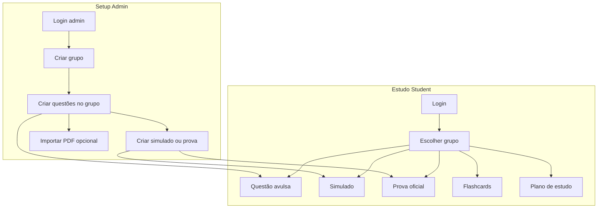
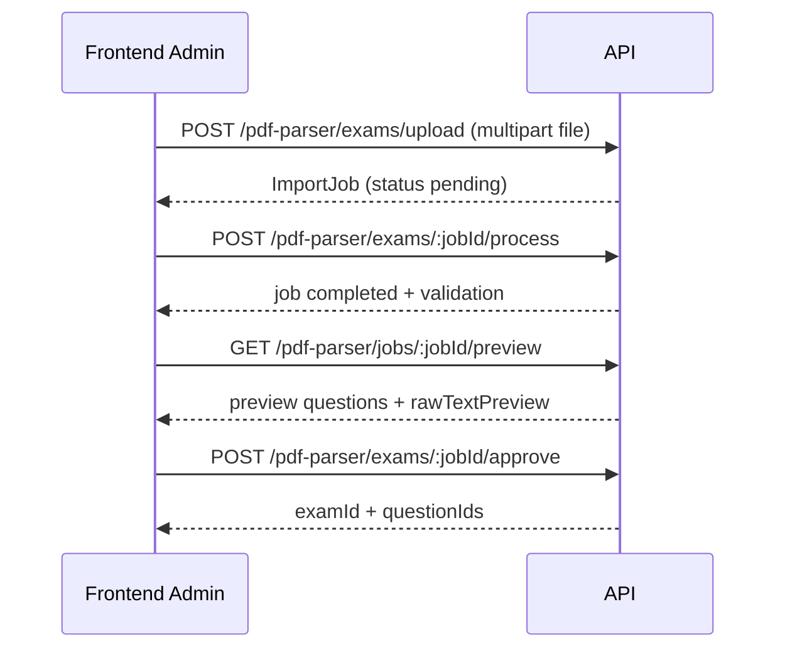
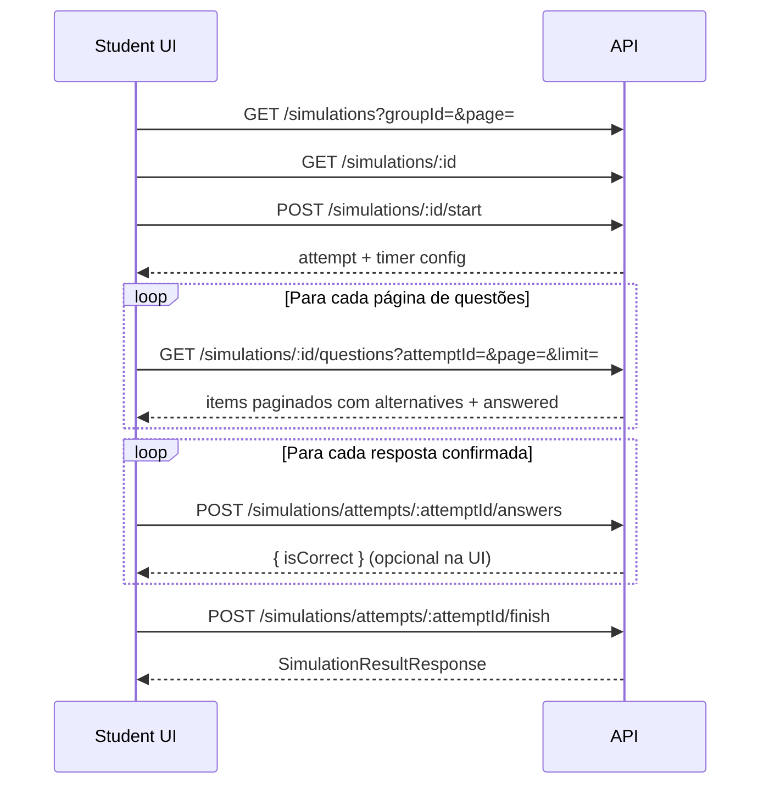

# Prompt — Atualização do Frontend (Offensive World)

Use este documento como **prompt de contexto** para atualizar o frontend e suas views. Ele descreve contratos da API, fluxos completos de negócio e recomendações de implementação para cadastro de provas/simulados, gestão de questões e realização de avaliações.

Referência complementar: [`docs/api-endpoints.md`](./api-endpoints.md)

---

## Prompt (copiar e colar para o agente de frontend)

```
Você vai atualizar o frontend da Offensive World para consumir a API REST em /api.

Regras obrigatórias:
1. Todas as requisições autenticadas usam header Authorization: Bearer <accessToken>.
2. Respostas de sucesso vêm no envelope { success, data, timestamp } — use sempre data.
3. Todos os endpoints de LISTAGEM retornam objeto paginado, NÃO array:
   { items, total, page, limit, totalPages }
   Query params: page (default 1), limit (default 20, max 100).
4. Trate erros HTTP lendo { success: false, message, statusCode }.
5. Separe views por persona: admin (CRUD) vs student (estudo/avaliação).
6. Questões avulsas, simulados e provas têm fluxos DIFERENTES de resposta — não misture endpoints.
7. Durante simulado/prova: NÃO revelar gabarito imediatamente (submit retorna só isCorrect).
8. Questão avulsa (POST /questions/:id/answer) retorna feedback imediato com correctAlternativeId e explanation.
9. Admin vê isCorrect/explanation em GET /questions/:id; student não vê gabarito antes de responder.
10. Implemente estado local de tentativa (attemptId, respostas, cronômetro) até chamar finish.

Implemente/refatore as views descritas em docs/frontend-integration-prompt.md, seguindo os fluxos sequenciais documentados.
Priorize: login → seleção de grupo → banco de questões → cadastro admin → realização student.
```

---

## 1. Convenções da API

| Item | Valor |
|------|--------|
| Base URL (dev) | `http://localhost:3000` |
| Prefixo | `/api` |
| Swagger | `/api/docs` |
| Auth | JWT Bearer |
| IDs | UUID v4 |

### Envelope de sucesso

```json
{
  "success": true,
  "data": { },
  "timestamp": "2026-05-30T12:00:00.000Z"
}
```

### Paginação (todas as listagens)

**Request:** `?page=1&limit=20` (+ filtros específicos do recurso)

**Response (`data`):**

```json
{
  "items": [],
  "total": 0,
  "page": 1,
  "limit": 20,
  "totalPages": 0
}
```

### Tipos TypeScript sugeridos

```typescript
export interface ApiEnvelope<T> {
  success: boolean;
  data: T;
  timestamp: string;
}

export interface Paginated<T> {
  items: T[];
  total: number;
  page: number;
  limit: number;
  totalPages: number;
}

export interface PaginationParams {
  page?: number;
  limit?: number;
}
```

### Helper de cliente HTTP

```typescript
async function apiGet<T>(path: string, token?: string, params?: Record<string, unknown>): Promise<T> {
  const url = new URL(`/api${path}`, API_BASE);
  if (params) {
    Object.entries(params).forEach(([k, v]) => {
      if (v !== undefined && v !== null && v !== '') url.searchParams.set(k, String(v));
    });
  }
  const res = await fetch(url, {
    headers: token ? { Authorization: `Bearer ${token}` } : {},
  });
  const body = await res.json();
  if (!res.ok || !body.success) throw new Error(body.message ?? 'Erro na API');
  return body.data as T;
}
```

---

## 2. Papéis e permissões na UI

| Papel | Views principais |
|-------|------------------|
| `admin` | Usuários, grupos, questões, tags, simulados, provas, PDF import, analytics por questão |
| `student` | Dashboard, banco de questões, simulados, provas, flashcards, planos de estudo |

**Regra:** esconder rotas/menus admin quando `user.role !== 'admin'`. Guards no frontend espelham guards da API, mas a API é a fonte da verdade.

---

## 3. Mapa de fluxos (visão geral)



---

## 4. Fluxo 0 — Autenticação

### Sequência

1. `POST /api/auth/login` com `{ email, password }`
2. Salvar `accessToken` (memória + storage seguro)
3. Salvar `user` (`id`, `name`, `email`, `role`)
4. Redirecionar: admin → painel admin; student → dashboard

### View sugerida

- **LoginPage**: formulário email/senha, tratamento de 401

---

## 5. Fluxo 1 — Setup do conteúdo (Admin)

Ordem recomendada para cadastro eficaz:

```
Grupo → Questões → (Tags opcionais) → Simulado ou Prova
```

### 5.1 Criar grupo

**Endpoint:** `POST /api/groups`

```json
{
  "name": "Concurso TJ-SP",
  "description": "Preparação",
  "type": "contest",
  "visibility": "public",
  "tags": ["concurso", "tj-sp"]
}
```

**View:** `GroupFormPage` / modal de criação  
**Listagem:** `GET /api/groups?page=1&limit=20` (+ filtros `type`, `visibility`)

> Todas as questões, simulados e provas de um grupo devem referenciar o **mesmo `groupId`**. A API rejeita questões de outro grupo.

### 5.2 Cadastrar questão (manual)

**Endpoint:** `POST /api/questions`

Dois tipos (`type`):

| Tipo | Campos |
|------|--------|
| `multiple_choice` (padrão) | `alternatives` (mín. 2), uma correta |
| `discursive` | `referenceAnswer` (gabarito textual); **sem** `alternatives` |

Campos obrigatórios:
- `statement`, `groupId`, `difficulty` (`easy` | `medium` | `hard`)
- Para múltipla escolha: `alternatives` com `label`, `content`, `isCorrect` (exatamente uma correta)
- Para discursiva: `referenceAnswer`

Campos opcionais: `type`, `discipline`, `topic`, `explanation`, `tags[]`

**Validações no frontend (antes de enviar):**
- Múltipla escolha: ≥2 alternativas, labels únicos, uma correta
- Discursiva: `referenceAnswer` preenchido, sem alternativas
- Grupo selecionado

**View:** `QuestionFormPage` com toggle tipo + editor de alternativas **ou** campo de gabarito textual

**Listagem/filtro:** `GET /api/questions?groupId=<uuid>&discipline=&topic=&difficulty=&tags=enem,matematica&page=1&limit=20`

> Na listagem, **não** vêm alternativas nem gabarito — só metadados e `statement`.

**Edição:** `PATCH /api/questions/:id` (metadados; alternativas não são editadas por este endpoint)

**Detalhe admin:** `GET /api/questions/:id` → mostra alternativas com `isCorrect` e `explanation`

### 5.3 Tags

**Criar tag:** `POST /api/tags` → `{ name }`  
**Listar:** `GET /api/tags?page=1&limit=50`  
**Vincular à questão:** `PUT /api/tags/questions/:questionId` → `{ names: ["enem", "matematica"] }`  
**Vincular ao grupo:** `PUT /api/tags/groups/:groupId` → `{ names: [...] }`

**View:** componente de chips/autocomplete reutilizável em questão e grupo

---

## 6. Fluxo 2 — Cadastrar simulado (Admin)

### Objetivo

Montar uma avaliação prática com timer configurável e conjunto fixo de questões.

### Sequência eficaz

1. Listar questões do grupo (paginado) e permitir seleção múltipla
2. `POST /api/simulations`:

```json
{
  "title": "Simulado ENEM - Matemática",
  "description": "Opcional",
  "groupId": "uuid-do-grupo",
  "timerMode": "fixed",
  "durationMinutes": 90,
  "questionIds": ["uuid-1", "uuid-2"]
}
```

| `timerMode` | Comportamento |
|-------------|---------------|
| `fixed` | `durationMinutes` **obrigatório** (≥ 1) |
| `free` | sem limite rígido no backend ao finalizar |

3. Confirmar com `GET /api/simulations/:id` → retorna `questionIds`
4. Listar simulados do grupo: `GET /api/simulations?groupId=<uuid>&page=1&limit=20`

### Views sugeridas

| View | Responsabilidade |
|------|------------------|
| `SimulationListPage` | Lista paginada por grupo |
| `SimulationBuilderPage` | Seleção de questões + config timer |
| `SimulationDetailPage` | Preview admin (metadados + qtd questões) |

### Regras importantes

- Mínimo 1 questão
- Todas as questões devem pertencer ao `groupId`
- Não existe endpoint de "adicionar questão depois" — recrie ou use fluxo de edição futuro; hoje o conjunto é definido na criação

---

## 7. Fluxo 3 — Cadastrar prova oficial (Admin)

### Diferença vs simulado

Prova tem metadados de concurso (`institution`, `organization`, `year`, `roleName`) e suporta **seções** com peso.

### Sequência eficaz — opção A (simples)

1. Selecionar questões do grupo
2. `POST /api/exams`:

```json
{
  "groupId": "uuid",
  "title": "TJ-SP 2025",
  "institution": "TJ-SP",
  "organization": "Vunesp",
  "year": 2025,
  "roleName": "Escrevente Judiciário",
  "durationMinutes": 300,
  "questionIds": ["uuid-1", "uuid-2"]
}
```

3. `GET /api/exams/:id` → `sections`, `questionIds`, `totalQuestions`

### Sequência eficaz — opção B (com seções)

1. Criar prova com questões iniciais (ou vazia se permitido — hoje exige ≥ 1 na criação)
2. `POST /api/exams/:id/sections`:

```json
{
  "name": "Conhecimentos Gerais",
  "weight": 1.5,
  "questionIds": ["uuid-3", "uuid-4"]
}
```

3. Repetir seções conforme necessário
4. Remover seção: `DELETE /api/exams/:id/sections/:sectionId`

### Views sugeridas

| View | Responsabilidade |
|------|------------------|
| `ExamListPage` | `GET /api/exams?groupId=&page=&limit=` |
| `ExamBuilderPage` | Wizard: metadados → questões → seções |
| `ExamSectionEditor` | CRUD de seções dentro da prova |

### Listagem de tentativas (student/histórico)

`GET /api/exams/attempts/me?page=1&limit=10`

---

## 8. Fluxo 4 — Importar prova/plano via PDF (Admin)

Alternativa ao cadastro manual quando há PDF estruturado.



**Jobs do usuário:** `GET /api/pdf-parser/jobs?page=1&limit=20`

**View:** `PdfImportWizardPage` com steps: Upload → Process → Preview/validação → Aprovar

---

## 9. Fluxo 5 — Responder questão avulsa (Student)

Modo **estudo/revisão** com feedback imediato.

### Sequência

1. Filtrar banco: `GET /api/questions?groupId=&page=&limit=`
   - Cada item traz `type`, `alternatives` (se múltipla escolha), `referenceAnswer` (se discursiva), `completed` e `lastAnswer`
2. Renderizar conforme o tipo:
   - `multiple_choice`: seleção de alternativa inline
   - `discursive`: campo de texto livre
3. Cronometrar tempo localmente por questão
4. Confirmar resposta: `POST /api/questions/:id/answer`
5. Atualizar item localmente ou refetch da página:
   - `completed: true`
   - `lastAnswer.isCorrect` para feedback visual
   - múltipla escolha: POST retorna `correctAlternativeId` e `explanation`
   - discursiva: POST retorna `similarityScore`, `referenceAnswer` e `explanation`
6. UI: marcar questões com `completed: true` e exibir gabarito/explicação

**Body — múltipla escolha:**

```json
{
  "selectedAlternativeId": "uuid",
  "timeSpentSeconds": 45
}
```

**Body — discursiva:**

```json
{
  "textAnswer": "Resposta do aluno...",
  "timeSpentSeconds": 120
}
```

**Resposta — múltipla escolha (`data`):**

```json
{
  "isCorrect": true,
  "correctAlternativeId": "uuid",
  "explanation": "Texto opcional"
}
```

**Resposta — discursiva (`data`):**

```json
{
  "isCorrect": true,
  "similarityScore": 0.91,
  "referenceAnswer": "Gabarito esperado",
  "explanation": "Texto opcional"
}
```

> Avaliação discursiva usa similaridade textual (sem IA). Score ≥ **0,72** = correto.

> Não é necessário abrir `GET /questions/:id` só para responder — a listagem já traz o necessário por tipo.

### View sugerida

| View | Detalhes |
|------|----------|
| `QuestionBankPage` | Lista paginada + filtros; cards com alternativas ou campo texto conforme `type` |
| `QuestionPracticePage` | Opcional — detalhe de uma questão; listagem já suporta resposta inline |

### Boas práticas

- Não cachear gabarito antes do submit
- Registrar `timeSpentSeconds` real (impacta analytics)
- Após responder, permitir "próxima questão" carregando do `items` paginado ou nova página

---

## 10. Fluxo 6 — Realizar simulado (Student)

Modo **avaliação** — feedback por questão é só `{ isCorrect }`, resultado completo só no finish.

### Sequência completa



### Passo a passo

1. **Escolher simulado** — listagem paginada por grupo; exibir `totalQuestions` em cada card
2. **Preview** — `GET /api/simulations/:id` → `questionIds.length`
3. **Iniciar** — `POST /api/simulations/:id/start`

Resposta:
```json
{
  "attempt": { "id": "...", "totalQuestions": 20, "finishedAt": null },
  "timer": { "mode": "fixed", "durationMinutes": 90 }
}
```

4. **Carregar questões paginadas**
   - `GET /api/simulations/:id/questions?attemptId=<uuid>&page=1&limit=10`
   - Cada item já traz `alternatives`, `sortOrder`, `answered` e `selectedAlternativeId` (se já respondida)
   - Navegar páginas até cobrir `totalQuestions`; **não** chamar `GET /questions/:id` por questão
5. **Montar prova na UI**
   - Manter estado local por página ou cache incremental entre páginas
   - Cronômetro global baseado em `timer.mode` / `durationMinutes`
6. **Submeter cada resposta** — `POST /api/simulations/attempts/:attemptId/answers`

```json
{
  "questionId": "uuid",
  "selectedAlternativeId": "uuid",
  "timeSpentSeconds": 30
}
```

- Upsert: reenviar mesma questão **substitui** resposta anterior
- Não enviar após `finishedAt` preenchido

7. **Finalizar** — `POST /api/simulations/attempts/:attemptId/finish`

```json
{
  "totalCorrect": 18,
  "totalWrong": 2,
  "totalTimeSeconds": 5400
}
```

> Se houver respostas salvas via submit, o backend **recalcula** totais a partir delas (valores do body podem ser ignorados quando há answers persistidas).

8. **Resultado** — resposta inclui `scorePercent`, `answers[]` com detalhes
9. **Retomar/consultar** — `GET /api/simulations/attempts/:attemptId`

### Views sugeridas

| View | Estado local necessário |
|------|-------------------------|
| `SimulationListPage` | groupId, paginação |
| `SimulationRunnerPage` | attemptId, índice questão, respostas, timer |
| `SimulationResultPage` | resultado do finish |

### UX crítica para eficácia

- Persistir `attemptId` em sessionStorage (refresh não perde tentativa)
- Barra de progresso: respondidas / totalQuestions
- Navegação livre entre questões antes de finalizar
- Botão "Finalizar simulado" com confirmação
- Em `timerMode: fixed`, auto-submit ao expirar tempo
- **Não** mostrar gabarito questão a questão (opcional: só ícone acerto/erro discreto)

---

## 11. Fluxo 7 — Realizar prova oficial (Student)

Analogous ao simulado, com diferenças:

| Aspecto | Simulado | Prova |
|---------|----------|-------|
| Start | `POST /simulations/:id/start` | `POST /exams/:id/start` |
| Answer | `POST /simulations/attempts/:id/answers` | `POST /exams/attempts/:id/answers` |
| Finish | `POST /simulations/attempts/:id/finish` | `POST /exams/attempts/:id/finish` |
| Resultado | `scorePercent` | `score` (0–100), metadados do concurso |
| Timer | fixed ou free | sempre `durationMinutes` da prova |
| Seções | não | opcional via `GET /exams/:id` → `sections` |

### Sequência

1. `GET /api/exams?groupId=&page=&limit=` — cada item inclui `totalQuestions`
2. `POST /api/exams/:id/start` → `attempt` + metadados `exam`
3. `GET /api/exams/:id/questions?attemptId=<uuid>&page=&limit=` — questões paginadas com alternativas
4. Loop de respostas → `POST /api/exams/attempts/:attemptId/answers`
5. `POST /api/exams/attempts/:attemptId/finish` com `{ totalCorrect, totalWrong, totalTimeSeconds }`
6. `GET /api/exams/attempts/:attemptId` → `ExamResultResponse`

### Validação de tempo

Backend rejeita finish se `totalTimeSeconds > durationMinutes * 60`. O cronômetro da UI deve respeitar esse limite.

### Views sugeridas

| View | Notas |
|------|-------|
| `ExamListPage` | Cards com institution/year/roleName |
| `ExamRunnerPage` | Layout estilo prova; sidebar por seção |
| `ExamResultPage` | Score + histórico |
| `ExamAttemptsHistoryPage` | `GET /exams/attempts/me` paginado |

---

## 12. Fluxo 8 — Flashcards (Student)

1. **Revisão pendente:** `GET /api/flashcards/pending?groupId=&page=&limit=`
   - Retorna só `frontContent` (sem spoiler)
2. Usuário revela verso → `GET /api/flashcards/:id` (backContent)
3. Autoavaliação → `POST /api/flashcards/:id/review` → `{ score: 1-5 }`

**View:** `FlashcardReviewPage` — fila paginada de pendentes

---

## 13. Fluxo 9 — Plano de estudo (Student)

1. `GET /api/study-plans?page=&limit=`
2. `GET /api/study-plans/:id` → items + progress
3. Concluir item → `POST /api/study-plans/items/:itemId/complete`

**View:** `StudyPlanPage` com barra de progresso (`completionPercent`)

---

## 14. Fluxo 10 — Analytics / Dashboard (Student)

`GET /api/analytics/dashboard` → métricas agregadas de questões avulsas + simulados + provas

**View:** `DashboardPage` — cards de acurácia, tópicos fracos/fortes, recomendações

Admin adicional: `GET /api/analytics/questions/:questionId`

---

## 15. Componentes reutilizáveis recomendados

| Componente | Uso |
|------------|-----|
| `PaginatedList<T>` | Wrapper genérico com page/limit/totalPages |
| `GroupSelector` | Contexto global de grupo ativo |
| `QuestionSelector` | Multi-select paginado para builders |
| `AlternativeList` | Render + seleção; modo admin com isCorrect |
| `ExamTimer` | Countdown para prova/simulado fixed |
| `AttemptProgress` | Questões respondidas / total |
| `TagInput` | Autocomplete com `GET /tags` |
| `ApiErrorToast` | Exibe message da API |

---

## 16. Estado global sugerido

```typescript
interface AppState {
  auth: { token: string; user: User } | null;
  activeGroupId: string | null;
  activeAttempt: {
    type: 'simulation' | 'exam';
    attemptId: string;
    startedAt: string;
    durationMinutes?: number;
    timerMode?: 'fixed' | 'free';
    answers: Record<string, { alternativeId: string; timeSpentSeconds: number }>;
  } | null;
}
```

---

## 17. Checklist de migração (breaking changes)

- [ ] Substituir expects de array em listagens por `Paginated<T>`
- [ ] Adicionar `page`/`limit` em todas as chamadas GET de lista
- [ ] Implementar controles de paginação (prev/next, page size)
- [ ] Atualizar tipos gerados / mocks de teste
- [ ] Separar rotas `/practice/questions` vs `/simulations/:id/run` vs `/exams/:id/run`
- [ ] Não usar `POST /questions/:id/answer` dentro de simulado/prova
- [ ] Não usar endpoints de attempt dentro de modo prática avulsa
- [ ] Tratar 403 em rotas admin
- [ ] Swagger em `/api/docs` para validação manual

---

## 18. Ordem de implementação sugerida

1. Camada API + tipos + paginação
2. Auth + layout + GroupSelector
3. Admin: grupos → questões → simulados → provas
4. Student: banco + prática avulsa
5. Student: runner de simulado
6. Student: runner de prova
7. Flashcards + planos + dashboard
8. PDF import wizard (admin)

---

## 19. Endpoints por view (referência rápida)

| View | Métodos principais |
|------|-------------------|
| Login | `POST /auth/login` |
| Groups (admin) | `GET/POST/PATCH/DELETE /groups` |
| Question bank | `GET /questions`, `GET /questions/:id`, `POST /questions/:id/answer` |
| Question form (admin) | `POST /questions`, `PATCH /questions/:id` |
| Simulation builder | `GET /questions`, `POST /simulations` |
| Simulation list | `GET /simulations?groupId=` |
| Simulation runner | `POST /simulations/:id/start`, `GET /simulations/:id/questions`, `POST .../answers`, `POST .../finish` |
| Exam builder | `POST /exams`, `POST /exams/:id/sections` |
| Exam list | `GET /exams?groupId=` |
| Exam runner | `POST /exams/:id/start`, `GET /exams/:id/questions`, `POST .../answers`, `POST .../finish` |
| Exam history | `GET /exams/attempts/me` |
| PDF import | `/pdf-parser/exams/*`, `GET /pdf-parser/jobs` |
| Dashboard | `GET /analytics/dashboard` |

---

*Documento alinhado com a API em `src/modules/*/presentation/controllers` e [`docs/api-endpoints.md`](./api-endpoints.md).*
